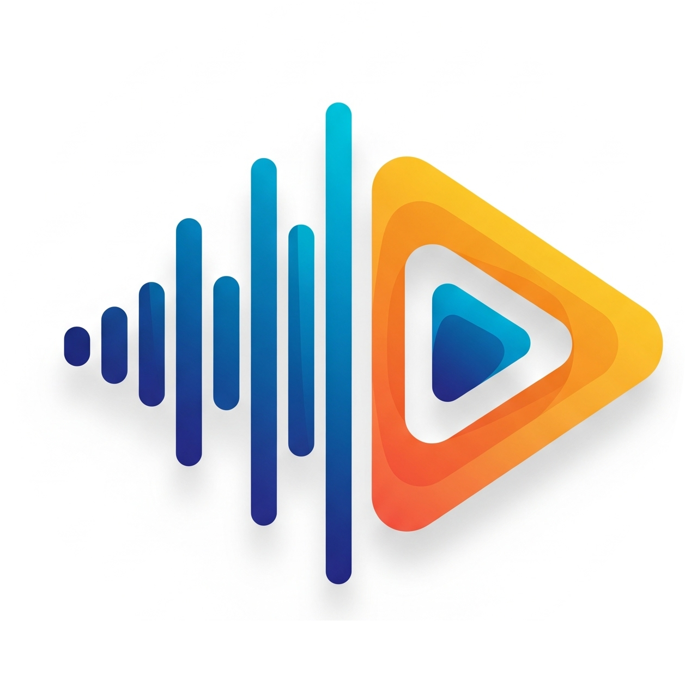
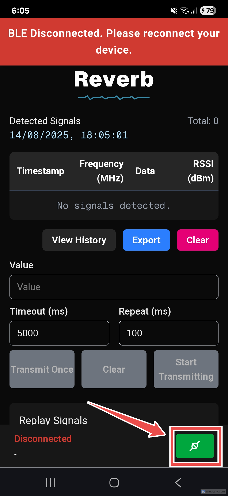
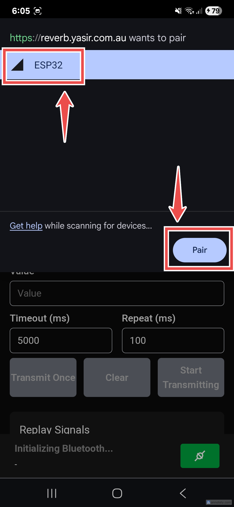
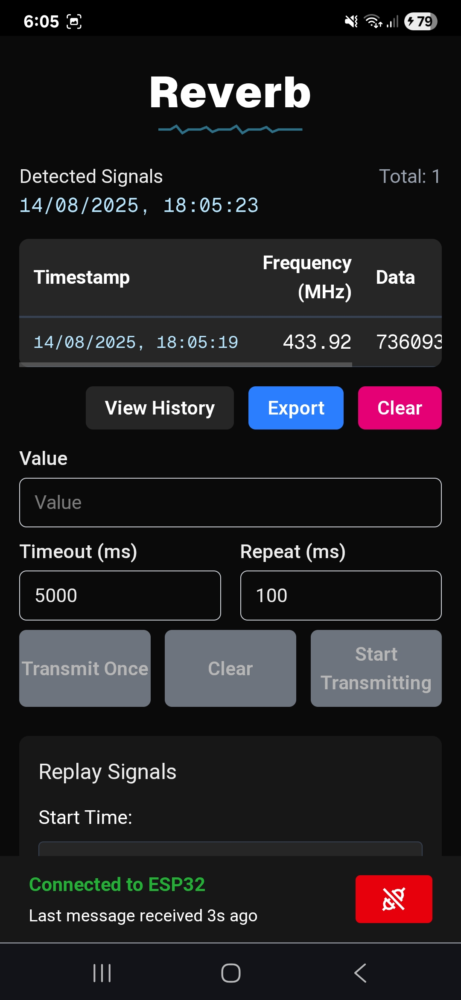
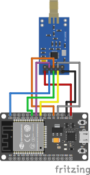
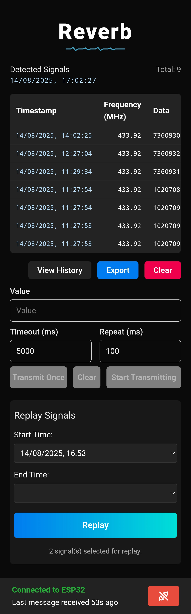
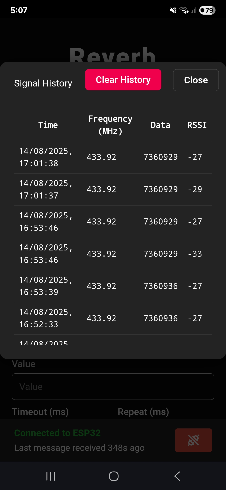

<p align="left">
   
</p>

# Reverb

A companion web app for ESP32 + CC1101, enabling BLE connection, RF signal analysis, and replay from your browser.

---

## Quickstart

1. **Flash Firmware:**  
   Download and flash the latest [firmware code](https://github.com/YM2992/Reverb/blob/main/reverb_esp32/reverb_esp32.ino) to your ESP32.

2. **Open the App:**  
   Go to [reverb.yasir.com.au](https://reverb.yasir.com.au) on a mobile or Bluetooth-enabled device.

3. **(Optional) Install as PWA:**  
   Add the app to your device's home screen (see [PWA Installation](#pwa-installation)).

4. **Connect:**  
   Press the **connect** button  
   

5. **Pair:**  
   Follow the pairing process  
   

6. **Enjoy!**  
   

---

## Features

- **Web Interface:** Use the app directly from your mobile browser.
- **BLE Connection:** Connect/disconnect to your ESP32 device via BLE.
- **Record Signals:** View received signals with Frequency, Data, and RSSI.
- **Transmit Signals:** Send custom RF signals via the web interface.
- **Replay Signals:** Replay signals from a selected time range.

### Coming Soon

- **[Wardriving](https://en.wikipedia.org/wiki/Wardriving):** Map and analyse RF signals in your area.
- **Signal Map:** Visualise recorded signals on a map.

---

## Use Cases

- **Signal Analysis:** Analyze and visualize sub-GHz RF signals for research or hobbyist purposes.
- **Remote Control:** Use the ESP32 as a remote control for other devices by transmitting custom RF signals.
- **Learning Tool:** Learn about RF communication and signal processing using the ESP32 and CC1101.

---

## Hardware

**Required Components:**

- **ESP32:** Main microcontroller for BLE and signal processing.
- **CC1101:** Sub-GHz RF transceiver for receiving/transmitting RF signals.

### Hardware Diagram



---

## App Screenshots

| Main Screen | Signal History Modal |
|-------------|----------------------|
|  |  |

---

## Self-hosting/Development

### Prerequisites

- [Node.js](https://nodejs.org/) (v18 or newer recommended)
- [npm](https://www.npmjs.com/)
- An ESP32 flashed with the provided firmware (`reverb_esp32.ino`)

### ESP32 Firmware

Firmware is at [`reverb_esp32/reverb_esp32.ino`](reverb_esp32/reverb_esp32.ino). Flash using Arduino IDE or PlatformIO.

### Running the Web App

1. Navigate to the `reverb` directory:
   ```sh
   cd reverb
   ```
2. Install dependencies:
   ```sh
   npm install
   ```
3. Start the development server:
   ```sh
   npm run dev
   ```

### Building for Production

```sh
npm run build
npm start
```

### Using the App Locally

On your Bluetooth-enabled device:

1. Open [http://HOST_IP:3000](http://HOST_IP:3000) in your browser.  
   (Replace HOST_IP with the actual IP address of the machine running the app.)

---

### PWA Installation

- On mobile, open the app in Chrome or Safari and use "Add to Home Screen" or "Install App" to install as a PWA.

---

## License

MIT License.

---

## Credits

- Inspiration from [SubMarine](https://github.com/simondankelmann/SubMarine)
- BLE and web UI connection based on [Random Nerd Tutorials](https://randomnerdtutorials.com/esp32-web-bluetooth/)
- Disconnect/Reconnect icons from [SVG Repo](https://www.svgrepo.com/)
